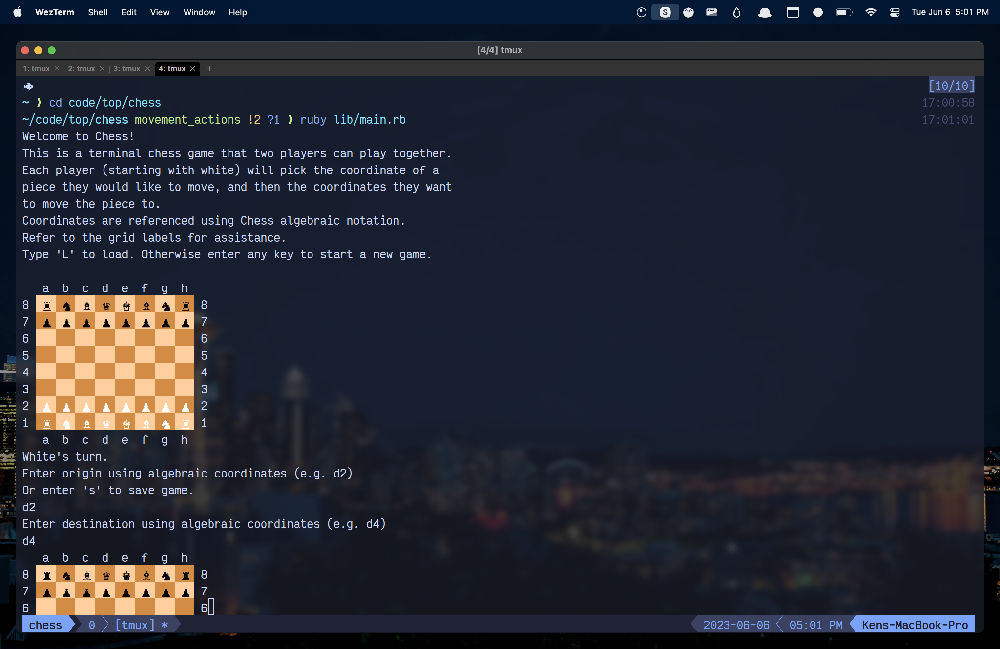

# # Chess (CLI)

This project allows two players to play Chess against each other using a CLI (command-line interface) on one machine. The players take turns inputting the positions of pieces and where they want to move them. The positions are picked using [chess algebraic notation](<https://en.wikipedia.org/wiki/Algebraic_notation_(chess)>).

[Click here to see a live-preview hosted on Replit.](https://replit.com/@mononoken/chess)

## Table of Contents

- [Tools Utilized](#tools-utilized)
- [General Information](#general-information)
- [Acknowledgements](#acknowledgements)
- [Reporting Issues / Feedback / Contact](#reporting-issuesfeedbackcontact)

## Tools Utilized

- [Ruby](https://www.ruby-lang.org/en/): language used
- [RSpec](https://rspec.info/): testing framework
- [SimpleCov](https://github.com/simplecov-ruby/simplecov): code coverage analysis tool
- [https://neovim.io/](https://neovim.io/): for _J K_ enjoying

## General Information

This project is the final project of The Odin Project's Ruby course. In the course, they teach basics of Ruby, OOP (object-oriented programming), some CS (computer science), and TDD (test-driven development). All this information is put to use in this project.

The project began with the premise of TDD, but it eventually evolved away from it. New features were 'requested' by first creating an acceptance test of some kind in RSpec. Then unit tests were written to try to TDD out the required pieces to pass the acceptance tests. Many of these beginning unit tests were refactored away.

A big lesson taken from this project was learning to get features working and moving on. The temptation to refactor and refactor and refactor to seek the _ultimate OOP dream_ was high.

Some design patterns were played with in this project. One of these patterns was the [Null Object Pattern](https://en.wikipedia.org/wiki/Null_object_pattern) that was discovered after abusing safe navigation (`&.`) frequently. Another was [pipelining](https://en.wikipedia.org/wiki/Pipeline_%28software%29) (see `Board#process_movement`).

## Acknowledgements

- Lucas, my [First Ruby Friend](https://firstrubyfriend.org) mentor. Thank you so much for meeting with me regularly and advising me on this project! Your help was and has been invaluable!
- [The Odin Project](https://www.theodinproject.com), my primary guide in the vast sea of web-development learning.
  - For providing this project idea ([see the instructions for this assignment here](https://www.theodinproject.com/lessons/ruby-ruby-final-project))
  - And the Discord community!
- [Sandi Metz](https://sandimetz.com/), whose book [Practical Object-Oriented Design](https://www.poodr.com/) helped me immensely on this project. She has been my favorite guide as I wander in the world of OOP.

## Reporting Issues/Feedback/Contact

Bug reports are greatly appreciated. You may create a new issue with a description of the problem, and the steps leading up to it.

PRs are kindly appreciated.

You may also contact me at: mail@feelsufo.com
